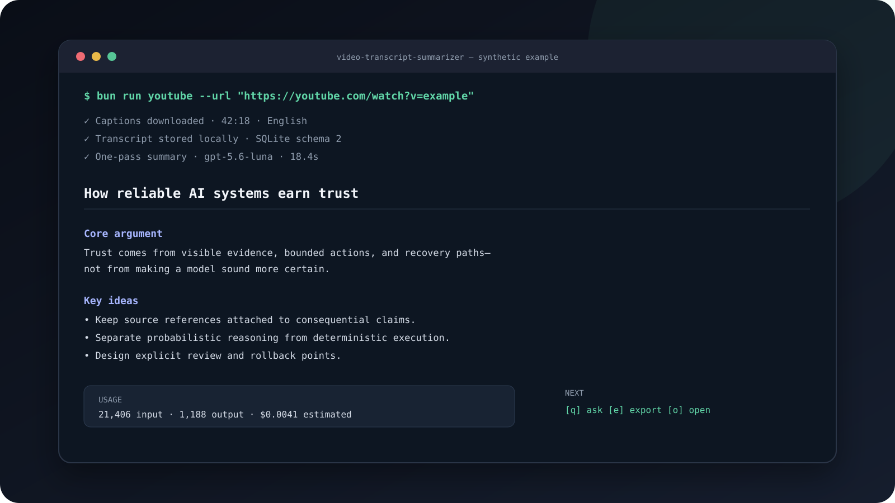

# YouTube Transcript Summarizer

This project stores YouTube, Vimeo, and X video transcripts in SQLite, generates summaries with OpenAI, and supports transcript Q&A. It prefers downloaded captions and falls back to local Whisper transcription only when captions are unavailable.



**Status:** maintained local-first CLI. Transcripts, summaries, Q&A, embeddings, and usage metrics stay in a local SQLite database unless a model request is explicitly made.

## Requirements

- Bun
- `yt-dlp`
- `ffmpeg`
- `whisper-cli` from `whisper.cpp`
- `OPENAI_API_KEY` for summarization, semantic search, and Q&A

## Install

```bash
git submodule update --init --recursive
bun install
```

Build `whisper-cli` and download a Whisper model before using the local
transcription fallback:

```bash
cmake -S whisper.cpp -B whisper.cpp/build
cmake --build whisper.cpp/build --config Release
./whisper.cpp/models/download-ggml-model.sh base.en
```

## Environment

Create `.env` in the project root:

```env
OPENAI_API_KEY=your_openai_api_key_here
WHISPER_CLI_BIN=./whisper.cpp/build/bin/whisper-cli
WHISPER_MODEL_PATH=./whisper.cpp/models/ggml-base.en.bin
TRANSCRIPT_LANGUAGE=en
```

Optional overrides:

- `MODEL_PROFILE` (`cheap`, `balanced`, or `quality`; defaults to `cheap`)
- `SUMMARY_MODEL`
- `QA_MODEL`
- `EMBEDDING_MODEL`
- `YTDLP_BIN`
- `FFMPEG_BIN`
- `TRANSCRIPTS_DB`
- `TRANSCRIPT_LANGUAGE` (caption and Whisper language; defaults to `en`)
- `SUMMARY_CHUNK_CONCURRENCY` (defaults to `3`, maximum `8`)
- `YTDLP_CONCURRENT_FRAGMENTS` (Whisper-fallback audio downloads; defaults to `8`, maximum `16`)

Model profiles:

- `cheap`: `gpt-5.6-luna` for summaries and Q&A
- `balanced`: `gpt-5.6-terra` for summaries, `gpt-5.6-luna` for Q&A
- `quality`: `gpt-5.6-sol` for summaries, `gpt-5.6-luna` for Q&A

The profiles also set task-appropriate reasoning effort and text verbosity.
Explicit `SUMMARY_MODEL` and `QA_MODEL` values override the model while retaining
the selected profile's reasoning and verbosity settings.

## Commands

```bash
bun run youtube
bun run video
bun run doctor
bun run typecheck
bun run test
```

`bun run test` is scoped to this app's `src` tests so it does not run unrelated
vendored tests inside `whisper.cpp`.

An opt-in paid comparison is available for an explicitly selected saved session:

```bash
bun run eval --content-id <CONTENT_ID> --profiles cheap,balanced,quality
```

The evaluator never chooses content automatically. It requires `OPENAI_API_KEY`,
makes paid requests, and writes ignored Markdown and JSON results under
`eval-results/`. Pass `--fixture checks.json` with optional `required` and
`forbidden` string arrays for deterministic content checks.

## Video Flow

```bash
bun run youtube
bun run video
```

The CLI can:

- start a new YouTube, Vimeo, or X video session from a URL
- reopen saved sessions from SQLite
- open the current summary as a proportional-font HTML document with the `o` hotkey
- export a durable formatted HTML summary from the `e` menu
- find a saved session semantically with `--find`
- export stored Q&A to Markdown or JSON
- reuse persisted embeddings for faster semantic find and transcript Q&A
- report and persist model, token usage, latency, and estimated API cost
- validate local dependencies, SQLite, and OpenAI access with `--doctor`

Non-interactive usage:

```bash
bun run youtube "https://x.com/<USER>/status/<POST_ID>"
bun run video "https://x.com/<USER>/status/<POST_ID>"
bun run youtube --url "https://www.youtube.com/watch?v=<VIDEO_ID>"
bun run youtube --url "https://vimeo.com/<VIDEO_ID>"
bun run youtube --url "https://x.com/<USER>/status/<POST_ID>"
bun run youtube --rerun "https://www.youtube.com/watch?v=<VIDEO_ID>"
bun run youtube --rerun "https://vimeo.com/<VIDEO_ID>"
bun run youtube --rerun "https://x.com/<USER>/status/<POST_ID>"
bun run youtube --find "video about vector databases"
bun run youtube --delete "https://www.youtube.com/watch?v=<VIDEO_ID>"
bun run youtube --delete "https://vimeo.com/<VIDEO_ID>"
bun run youtube --delete "https://x.com/<USER>/status/<POST_ID>"
bun run youtube --doctor
```

The `youtube`, `video`, and `start` scripts run the same CLI entrypoint:
`src/youtube.ts`.

Transcripts up to 500,000 characters use one-pass long-context summarization and
full-transcript Q&A. Larger transcripts retain chunked summarization and RAG Q&A.
If OpenAI rejects a direct summary request for size, the CLI automatically falls
back to the chunked path.

## Storage and reliability

The app stores transcripts, summaries, Q&A, and cached embeddings in SQLite.
Schema changes are tracked with SQLite's `user_version`. Before the first mutation
of an existing database in each process, the app writes a timestamped backup to
`db_backups/` and retains the ten newest backups.
Summary and Q&A usage metrics are nullable for old rows. Dollar amounts are
estimates based on the pricing table dated 2026-08-01; arbitrary model overrides
still record tokens and latency but display cost as unavailable.

The application code is split into three main areas:

- `src/youtube.ts`: provider retrieval, summarization, Q&A, and CLI interaction
- `src/database.ts`: SQLite paths, migrations, backups, and transcript encoding
- `src/config.ts`: model profiles and environment-driven configuration
- `src/openai-metrics.ts`: dated token pricing, usage aggregation, and formatting

## License

The application code is available under the [MIT License](LICENSE). The `whisper.cpp` submodule is vendored and remains under its own upstream license.

## Troubleshooting

Run `bun run doctor` first. It reports missing executables or model files,
database errors, a missing API key, and OpenAI connectivity failures.

- Captions are requested using `TRANSCRIPT_LANGUAGE`. If none are available,
  Whisper uses the same language value. The fallback prefers audio at or below
  80 kbps, downloads fragmented streams concurrently, and segments the original
  audio without a full-file MP3 transcode.
- A language-specific Whisper model such as `base.en` should only be used for
  that language. Use a multilingual Whisper model when changing the language.
- Override inaccessible models with `SUMMARY_MODEL` and `QA_MODEL`.
- Set `TRANSCRIPTS_DB` to use a specific database instead of automatic discovery.
